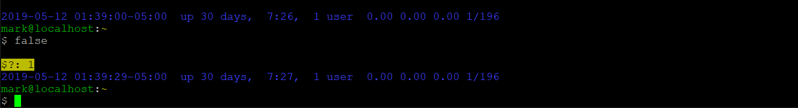

# Bash Prompt Customization

My preferred Bash prompt:

## Rationale

Consider the default CentOS / RHEL Bash prompt:

	[username@hostname ~]$ 

... or under Debian / Ubuntu (some versions put a space before the dollar prompt):

	username@hostname:~$ 

Compared to a colored, 2-line prompt (colors not shown here or elsewhere due to Markdown limitations):

	username@hostname:~
	$

Advantages of the last:

1. Allows for more room for command entry.
2. Command entry always starts at the same column (3) - regardless of the length of the current path (`$PWD`).
3. Provides clear separation between commands - due to both the color and the newline before each prompt, as well as adding distinction between the prompt and the command entry.
4. Follows the same semantics already set by default in `$PROMPT_COMMAND` to set the window title.
5. Makes it easiy to use SCP, rsync, etc., between hosts - as the prompt follows the identical semantics required by these programs, allowing for this portion to be simply copied & pasted:

		[[user@]host1:]file1

Continue reading below for the full version.  However, for a basic version as a one-liner:

1. Simply run the following - or include near the end of `~/.bashrc`:

		PS1='\n\[\e[32m\]\u@\h\[\e[0m\]:\[\e[33m\]\w\[\e[0m\]\n\$ '

2. For a root Bash prompt, the syntax is the same as above - but changes the username & host color from green to red.  In `/root/.bashrc`:

		PS1='\n\[\e[31m\]\u@\h\[\e[0m\]:\[\e[33m\]\w\[\e[0m\]\n\$ '

	* Bash will automatically substitute a `#` for the `$` (dollar prompt) for the root user.

## Beyond the Basics

	$?: 1
	2019-05-12 01:39:29-05:00  up 30 days,  7:27,  1 user  0.00 0.00 0.00 1/196
	mark@localhost:~
	$

1. The first line (as shown) displays the return code from the last commmand, but only if non-zero.
	1. This is shown on its own line, using black test on a yellow background.
	2. Typically this is something that needs attention, as it usually means the previous command returned something other than a "success".
	3. A similiar approach for this is further detailed at <https://blog.superuser.com/2011/09/21/customizing-your-bash-command-prompt/>.
2. The next line shows in blue (low contrast, as to not be too obtrusive):
	1. The current date and time.
		1. Helpful for keeping track of how long commands took to execute - and when looking back, when they were executed.
		2. The date/time format is in [ISO 8601](https://en.wikipedia.org/wiki/ISO_8601) format (technically [RFC 3339](https://tools.ietf.org/html/rfc3339)), the [only correct way to write numeric dates](https://xkcd.com/1179/).  (An Internet and global standard, unambiguous, provides for proper sorting, etc.)
	2. The system uptime (reformatted from `uptime`) and current number of users.
	3. The load average (from `/proc/loadavg`).
		1. Helpful as an indicator if the system load starts spiking while you're working on the system - also something that may require attention!
3. The last 2 lines remain exactly as outlined in the basic example above.

I typically run my terminals at 120 characters - but this still fits nicely in a default 80-column window.  (The longest line is 75 characters as-shown, while still allowing for any needed overflow, such as 100+ day uptimes.)

## Configuration / Installation

1. Copy [`maz-bash-prompt.sh`](maz-bash-prompt.sh) to an appropriate location for use.
	1. This could be under `/etc`, or `~` (the home directory).
2. Source (`source` or `.`) the output of the script.  For example:

		. <(/etc/maz-bash-prompt.sh)
	or

		. <(~/maz-bash-prompt.sh)
3. For persistent use, append the same command used above to the end of your `~/.bashrc`.

## Limitations

1. Only supported by Bash (not ash, csh, dash, ksh, sh, tcsh, zsh, etc.)
2. When run under Cygwin (where `$OSTYPE` starts with `cygwin`), the uptime and load averages are not included by default due to specific performance concerns (as commented within the script).
3. Does not (yet) include support for including an indicator from any `/etc/debian_chroot`.

## Contributing

Bug reports and pull requests are welcome on GitHub at <https://github.com/ziesemer/maz-bash-prompt>.

## References

1. <https://help.ubuntu.com/community/CustomizingBashPrompt>
2. <https://blog.superuser.com/2011/09/21/customizing-your-bash-command-prompt/>
